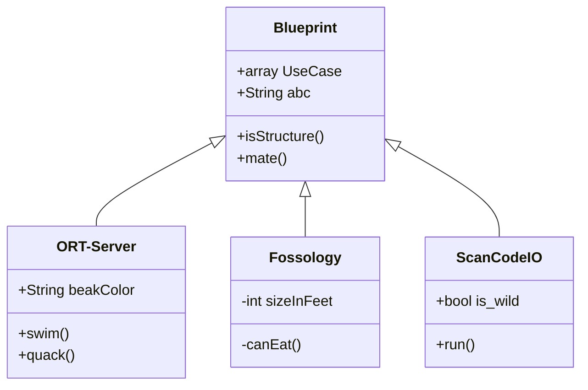

```mermaid
classDiagram
      Blueprint <|-- ORT-Server
      Blueprint <|-- Fossology
      Blueprint <|-- ScanCodeIO
      Blueprint : +array UseCase
      Blueprint : +String abc
      Blueprint: +isStructure()
      Blueprint: +mate()
      class ORT-Server{
          +String beakColor
          +swim()
          +quack()
      }
      class Fossology{
          -int sizeInFeet
          -canEat()
      }
      class ScanCodeIO{
          +bool is_wild
          +run()
      }
```