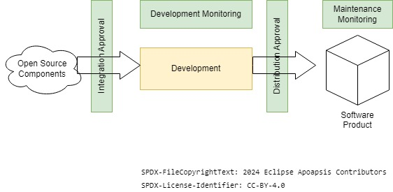

<!--
SPDX-FileCopyrightText: Copyright (C) 2025 Contributors to the Eclipse Foundation

These materials are made available under the
terms of the Creative Commons Attribution 4.0 International Public License which is available at
https://creativecommons.org/licenses/by/4.0/legalcode .

Unless required by applicable law or agreed to in writing, software
distributed under the License is distributed on an "AS IS" BASIS, WITHOUT
WARRANTIES OR CONDITIONS OF ANY KIND, either express or implied. See the
License for the specific language governing permissions and limitations
under the License.

SPDX-License-Identifier: CC-BY-4.0
-->

# Software Component Lifecycle Process

*This document is a template for a process description and needs to be adapted to a specific organization before usage. Especially the parts put in angle brackets "< >".*

# Process Objectives

Ensuring transparent open source software usage by fulfilling the requirements of the < Open Source Policy of the organization >.

# Process Scope

< please enter your organization specific scope of this process >

# Process Description

  

The Software Component Lifecycle consist of four elements. The distribution check is the major gateway to ensure that only qualified software is released. The other elements only support this effort.

- Integration Check: Pre-check that development capacity is only invested in technology that can be delivered later on.
- Development Monitoring: Process to provide an overview on all integrated software components and their status at any time during development for each project or product.
- Distribution Check: This gateway ensures that all necessary software management tasks have been processed successfully before the corresponding software is allowed to be made available to external parties. < It is done as part of the quality gate. >
- Maintenance Monitoring (optional): Process to ensure that the criteria of the distribution check are still met after distribution under considerations of the current information.

# Templates

- A2.4 Non-standard concept template

# Roles

- < Management >
- < Open Source Office: 
    - The Open Source Office defines the Open Source Management requirements necessary for a distribution check. 
    - The Open Source Office is informed about new Open Source Software Integration Checks. 
    - The Open Source Office provides the organization specific configuration of the Open Source Management Review system. 
    - The Open Source Office need to approve Non-standard Open Source Management concepts. >
- < Responsible Person for a product >
- Development Team: 
    - Evaluate new software components and request integration check, integrate software components in conformance with the guidelines
- < Open Source Management Representative: 
    - The Open Source Management Representative ensures that all relevant tasks for the software Distribution Check are processed prior to release. 
    - The Open Source Management Representative monitors the Open Source Management reviews and supports the development team in resolving and dispatching issues. >
- Source Code Auditor: 
    - The Source Code Auditor supports the review and analysis of the project source code review results.
- Curator (Curation team): 
    - The Curator supports the metadata curation of identified components with missing or unclear metadata. 
    - The Curation team maintains the underlying components metadatabase of the Open Source Management Review system.

# Process Details

## Integration Check
The integration check is supported by the attachment "A1 Integration Check"

## Distribution Check
A Distribution Check requires the successful completion of the following tasks as part of the Open Source Management Review (see attachment "A2 Development Monitoring"):

1. Open Source Management Dependency Review: Scan for and investigation of all integrated third party software artifacts with the defined Open Source Management Dependency Review solution, details see attachment "A3 Open Source Management Dependency Review".
2. Open Source Management Project Source Review: Scan for and investigation of all integrated third party source code in the project's source code that is used to build the organizations software artifacts with the defined Open Source Management Project Source Review solution, details see attachment "A4 Open Source Management Project Source Review".
3. FOSS Compliance Bundle:
    
    a.) Open Source Software Disclosure Document: Complete decisive list of all integrated Open Source Software components, details see attachment "A5.1 OSS Disclosure Document"
    
    b.) OSS Source Code Bundle: Collection of the complete source code for all integrated software components, where the license requires the source code disclosure as listed in the OSS disclosure document, details see attachment "A5.2 OSS Source Code Bundle".
4. OSM Bi-directional Traceability: all the relevant information about the release and the integrated Open Source components need to be provided centrally to enable bidirectional traceability, details see attachment "A8 Open Source Meta Database".

The following picture gives and overview of the tasks and their sequence:

# Deviations
This is the standard process to ensure open source compliance in the organization. However, because of the variety of activities of the organization we also have various special situations where other approaches might be more efficient. Therefore it is possible to design a different process for fulfilling the requirements of the organization's Open Source Policy. The Non-standard template (attachment A2.4) need to be used.

The Open Source Management Representative must be consulted for the design of a deviating process and it must be appoved by the Open Source Office before set into effect.

# Attachments

|Attachment|Description|
|:------------------------------------------------------------------------------|:-----------------------------------------------------------------------------|
| [A1 Integration Check](A1_integration_check/a1_integration_check.md) | HowTo perform the Integration Check for Open Source Components |
| [A2 Development Monitoring](A2_development_monitoring/a2_development_monitoring.md) | Description of generic Open Source Management Review steps as preparation for the Distribution Check. Description of standard scheme to describe existing standard Open Source Management Review setups. |
| A2.1 Standard Open Source Management Review - Reference Tooling | Standard Open Source Management Review using the Open Source reference tooling described based on standard scheme. |
| A2.2 Standard Open Source Management Review - Trusted Package Metadatabase | General description for Standard Open Source Management Reviews using "matching"-mechanisms and trusted package metadatabases described based on standard scheme.|
| A2.3 Standard Open Source Management Review - Snippet Database | Description of Open Source Management Review with snippet scanner and fingerprint matching as forensic tool combined with license and copyright scanner described based on standard scheme.|
| A2.4 Non-standard Open Source Management Review | HowTo handle Open Source Management concepts for projects not using one of the Standard Open Source Management Review setups including a concept template. |
| A3 Open Source Management Dependency Review | Description of the Open Source Management Dependency Review (independent from the Open Source Managemen Review setup). |
| A4 Open Source Management Project Source Review | Description of the Open Source Management Project Source Review concept and reference to best practices. |
| A5 FOSS Compliance Bundle | Description of the FOSS Compliance Bundle. |
| A5.1 OSS Disclosure Document | Description of the OSS Disclosure Document and Reference to Best Practices. |
| A5.2 OSS Source Code Bundle | Description of the OSS Source Code Bundle and Reference to Best Practices. |
| [A6 Distribution Check and Quality Gate](A6_distribution_check_and_quality_gate/a6_distribution_check_and_quality_gate.md) | Open Source Management specific check questions that need to be part of the Quality Gate Checklist. |
| A7 Maintenance Monitoring | Description of the Maintenance Monitoring Concept and Reference to Best Practices. |
| A8 Open Source Metadatabase | Description of the Open Source Metadatabase concept and Reference to Best Practices. |
| A9 Open Source Usage Policies | Set of default Open Source Usage policies for specific setups and Reference to Best Practices. |